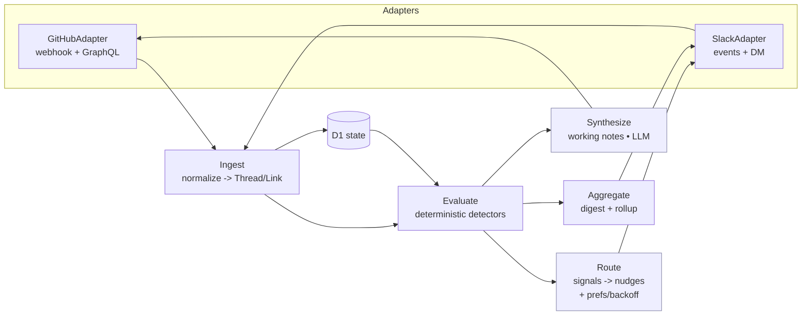

# aipm — design

## 1. Goal & principles

An automatic, suggest-only bot that turns "work that someone should have done"
into a drafted suggestion: nudge the person who owes an action, and keep a
working-notes summary current on each thread. Principles: suggest-only, low-noise
(dedupe + digest fallback + mute/snooze), deterministic detection with bounded
LLM use, and shadow-mode rollout.

The engine is platform-neutral; everything platform-specific lives in an adapter.



## 2. Domain model

Core TypeScript interfaces in `core/`. No type here names GitHub or Slack.

```ts
type PlatformId = "github" | "slack" | string;

interface Identity {
  id: string; // canonical internal id
  handles: Partial<Record<PlatformId, string>>; // { github: login, slack: "U…" }
  email?: string;
  displayName?: string;
}

interface Thread {
  platform: PlatformId;
  nativeId: string; // e.g. "owner/repo#123" or Slack "C…/ts"
  type: "issue" | "pr" | "slack_thread" | "channel";
  title?: string;
  body?: string;
  state: string; // adapter-normalized (open/closed/merged/…)
  participants: string[]; // Identity ids
  owner?: string; // Identity id of who owns the next step
  meta: Record<string, unknown>; // labels, board status, draft flag, etc.
  timeline: TimelineEvent[];
}

interface TimelineEvent {
  kind: string; // comment, review, label, mention, status, …
  actor?: string; // Identity id
  at: string; // ISO timestamp
  data: Record<string, unknown>;
}

interface Link {
  from: string;
  to: string;
  kind: LinkKind;
}
type LinkKind = "closes" | "refs" | "sub_issue" | "blocked_by" | "cross_ref" | "mention" | "manual";

interface Cluster {
  id: string;
  threadIds: string[];
}

interface WorkingNotes {
  scope: "thread" | "cluster";
  targetId: string;
  content: string;
  contentHash: string; // idempotency
  provenance: string;
}

interface Signal {
  id: string;
  threadId: string;
  kind: SignalKind;
  owedBy?: string; // Identity id who owes the action
  detectedAt: string;
  clearedAt?: string;
}

interface Nudge {
  person: string; // Identity id
  signalId: string;
  channel: "dm" | "digest";
  dedupeKey: string; // `${person}:${threadId}:${signalKind}`
  sentAt?: string;
  state: "pending" | "sent" | "cleared" | "shadow";
  escalations: number;
}

interface Preference {
  person: string;
  rule: "mute" | "snooze" | "route" | "own";
  selector: Record<string, unknown>; // e.g. { repo, priority } or { threadId }
  until?: string; // for snooze
}
```

## 3. Platform adapter interface

```ts
interface Platform {
  id: PlatformId;
  listThreads(query): Promise<Thread[]>; // for sweeps
  getThread(nativeId): Promise<Thread>;
  getTimeline(nativeId): Promise<TimelineEvent[]>;
  discoverLinks(thread): Promise<Link[]>;
  postMessage(target, body): Promise<{ id: string }>;
  editMessage(messageId, body): Promise<void>;
  react(messageId, emoji): Promise<void>;
  notifyPerson(identity, body): Promise<void>; // DM / mention
}
```

- **GitHubAdapter** — verifies webhook signatures; normalizes issue/PR payloads
  and GraphQL reads into `Thread`/`TimelineEvent`; implements `discoverLinks`
  (§4); posts/edits the sticky working-notes comment.
- **SlackAdapter** — verifies the signing secret; handles events / slash command
  / App Home; opens DMs; parses preference messages (§8); models Slack threads as
  `Thread`s.
- **LLM adapter** — a thin `complete(prompt)` behind AI Gateway, so the model
  provider is swappable and responses are cached.

## 4. Link discovery

Prefer GitHub's **native relations** over parsing body text. Each `LinkKind` has
a primary source; a configurable regex layer is a fallback for team-specific
conventions and is set per deployment, never in core.

| kind                           | primary source                                                                                                                                                                                                                 |
| ------------------------------ | ------------------------------------------------------------------------------------------------------------------------------------------------------------------------------------------------------------------------------ |
| `closes`                       | PR GraphQL `closingIssuesReferences` (GitHub resolves close/fix/resolve keywords itself). Inverse from an issue: `closedByPullRequestsReferences` if available, else the issue `timelineItems` `ClosedEvent`/`ConnectedEvent`. |
| `refs`, `mention`, `cross_ref` | `timelineItems`: `CrossReferencedEvent`, `ConnectedEvent`.                                                                                                                                                                     |
| `sub_issue`                    | `subIssues` / `parent` / `subIssuesSummary` (requires request header `GraphQL-Features: sub_issues`).                                                                                                                          |
| `blocked_by`                   | issue-dependency `blockedBy` / `blocking`.                                                                                                                                                                                     |
| `manual`                       | operator grouping (UI / API).                                                                                                                                                                                                  |

**Contract tests:** for each kind, feed a captured GraphQL/timeline fixture into
`GitHubAdapter.discoverLinks` and assert the expected `Link` is produced. The
regex fallback has its own fixtures (closing keywords + `owner/repo#N`).

`Cluster`s are connected components over the resulting `Link` set, plus any
`manual` grouping.

## 5. Identity resolution

The hard part is that Slack DMs need a Slack **user ID** (`U…`), which rosters
rarely store. Resolution is explicit and pluggable:

1. **Identity source** (pluggable): a config file, a directory/SCIM sync, or
   enumerating org members. Produces partial `Identity` rows (at least a GitHub
   login and an email or Slack handle).
2. **Slack id resolution:** `users.lookupByEmail` (preferred) or `users.list`
   matched on handle → store the `U…` id on `Identity.handles.slack`. Cache it;
   refresh on miss.
3. **Fallback:** a participant with no resolved Slack id is never DM'd — their
   signals route to a digest only, and the gap is logged so the source can be
   extended.

## 6. Engine pipeline

`Ingest → Evaluate → Synthesize → Route → Aggregate`, decoupled by Queues so LLM
work is bounded and retryable. A Durable Object per cluster (or per thread)
serializes updates so concurrent events can't double-nudge.

- **Ingest** — webhook or sweep → adapter normalizes → upsert `Thread`/`Link`/
  participants in D1. KV holds the webhook delivery-id for dedupe.
- **Evaluate** — run **deterministic** signal detectors over the timeline +
  meta + state. No LLM. Emits/clears `Signal`s.
- **Synthesize** — (LLM) update `WorkingNotes`; re-post only when `contentHash`
  changes.
- **Route** — turn open `Signal`s into `Nudge`s: apply `Preference`s, choose
  channel by priority, enforce dedupe/backoff. (LLM only for nudge wording.)
- **Aggregate** — build per-person digests and a cluster-notes rollup.

**LLM is used only for:** judging whether a reply answered the question, nudge
wording, and notes summarization. Everything else is deterministic.

## 7. V1 signal spec

All thresholds are configuration. "Quiet period" is a business-day-aware duration
(deployment sets timezone + working days).

| Signal                      | Trigger         | Nudge target           | Quiet period       | Channel                 | Clears when             |
| --------------------------- | --------------- | ---------------------- | ------------------ | ----------------------- | ----------------------- |
| @mentioned, no response     | webhook         | mentioned person       | 1 business day     | DM (high pri) / digest  | they reply              |
| review requested            | webhook         | reviewer               | 1 business day     | DM                      | review submitted        |
| unaddressed review comments | webhook         | PR author              | 1 business day     | DM                      | author replies / pushes |
| PR open, no reviewer        | webhook + sweep | author                 | 4h                 | DM                      | reviewer added          |
| draft PR aged               | sweep           | author                 | > 7 days           | digest                  | marked ready / closed   |
| in-progress stale           | sweep           | owner/assignee         | > N days no update | digest (DM if high pri) | thread updated          |
| blocker cleared             | webhook         | blocked thread's owner | immediate          | DM                      | — (fires once)          |

Rules:

- **Universal stop condition:** when a thread reaches a terminal state
  (closed/merged/done), all its signals clear.
- **Dedupe/backoff:** one nudge per `dedupeKey` per quiet period; after `N`
  escalations a signal drops to digest-only. State lives in D1.
- **Priority routing:** high priority → immediate DM; otherwise per-person
  digest. `Preference` mute/snooze always wins.
- **Bot exclusion:** authors whose login ends in `[bot]` (and a configurable list
  of automation accounts) are never nudge targets and are ignored when deciding
  "is a human reply owed."
- Priority and any label/state-derived inputs come from `Thread.meta`; which
  fields exist is the deployment's concern, not core's.

## 8. Working notes, suggest-only & Slack

**Working notes:** one bot-owned **sticky comment per thread**, edited in place
(never N appended comments), idempotent via `contentHash`. Contents: linked
PRs/issues and their state, a summary of discussion/decisions, open questions, the
current blocker, what's needed to move forward, and who owns the next step.
Cluster notes roll the per-thread notes up for related work.

**Suggest-only mechanics:**

- The notes comment is the bot's own artifact — it edits it freely.
- Any change to **human-authored** content (description/labels/state) is posted as
  a _proposed edit_ approved by one reaction (✅) or `reply APPLY`; applied only on
  approval, recorded in D1.
- **Shadow mode** (global + per-capability): compute and log would-be actions,
  post nothing. Flip on per capability after reviewing the log.

**Bidirectional Slack:** DMs / slash command / App Home capture `Preference`s
("mute repo X", "snooze me to Monday", "I care about repo Y high-pri", "I own Z"),
parsed with a light LLM into D1. Slack threads are first-class `Thread`s, so a
support discussion can cluster with its GitHub issue.

**Visibility:** an automatic per-person digest (the push side of "what's on my
plate") and a daily Slack channel pulse for org-visible attention items, backed
by the stored org rollup over cluster notes. Later: a read-only Cloudflare Pages
dashboard if browsing/history becomes necessary.

## 9. Stack & data

| Concern                                        | Cloudflare primitive      |
| ---------------------------------------------- | ------------------------- |
| HTTP ingress (webhooks, Slack events/commands) | Workers                   |
| Time-based sweeps (staleness, draft age)       | Cron Triggers             |
| Decouple ingest from evaluate/synthesize       | Queues                    |
| Serialize per-thread/cluster updates           | Durable Objects           |
| Relational state                               | D1 (SQLite)               |
| Delivery-id dedupe, short-lived flags          | KV                        |
| Summaries + judgment                           | Workers AI via AI Gateway |

**D1 schema sketch:** `identities`, `threads`, `links`, `clusters`,
`cluster_threads`, `signals`, `nudges` (with `dedupeKey`, `escalations`,
`sentAt`), `preferences`, `working_notes` (with `contentHash`). Secrets
(GitHub App private key, Slack bot token + signing secret, AI Gateway binding)
are Worker secrets. Deploy via Wrangler.

## 10. Rollout phases

1. **Core + GitHub read** — domain types, D1 schema, identity source +
   resolution, `GitHubAdapter` ingest (webhook + sweep), Wrangler scaffold.
   Shadow mode.
2. **Working notes** — synthesis + sticky comment on issues/PRs; link discovery.
3. **Slack outbound + nudges** — `SlackAdapter` DMs, deterministic signal engine,
   D1 dedupe/backoff. Turn off shadow mode for nudges.
4. **Bidirectional Slack** — preference capture, personalized routing, per-person
   digest.
5. **Clusters + visibility** — clustering over links, cluster notes, daily Slack
   org pulse, LLM-judged signals (Slack threads as `Thread`s).

## 11. Verification

- **Adapter contract tests** — captured GraphQL/timeline fixtures → assert the
  right `Link`s and a normalized `Thread`.
- **Signal-detector unit tests** — synthetic timelines exercise each row of §7,
  including the clear conditions and bot-exclusion.
- **Idempotency test** — re-synthesizing unchanged notes produces the same
  `contentHash` and posts nothing.
- **Local replay** — `wrangler dev` + replayed webhook/Slack payloads.
- **D1 migration** apply/rollback test.
- **Shadow run** — run against real repos for a few days; review the log of
  would-be notes + nudges before enabling any posting.
- **End-to-end** — open a test PR with no reviewer → confirm a (shadow) DM nudge
  to the author within the quiet period; add a reviewer → confirm the signal
  clears.

## 12. Risks

- **LLM quality vs cost** for summarization/judgment — mitigated by AI Gateway
  caching + provider pluggability.
- **Abuse / runaway cost** — a public repo lets anyone comment (GitHub still
  delivers a _signed_ webhook), and bugs can loop. Two guards, both default-on:
  a **member-trigger gate** (`REQUIRE_MEMBER_TRIGGER`) drops, at ingress, any
  event whose actor isn't in the identity roster — before any queue/DO/LLM spend;
  and a two-window **LLM budget cap** (`LLM_PER_MINUTE_BUDGET` / `LLM_DAILY_BUDGET`,
  counters in KV) hard-stops spend on a flood or loop, degrading to deterministic
  work only. The queue consumer's bounded concurrency caps the spend _rate_
  independently and keeps the KV counter accurate. Set the gate to `false` on a
  fully-trusted (e.g. private) repo.
- **Identity coverage** — unresolved Slack ids silently drop people to digest;
  log the gaps and make the identity source easy to extend.
- **Worker CPU/time limits** on heavy syncs — push work through Queues + DOs.
- **Adoption of the approval flow** — keep approval to one reaction click.
- **Slack DM consent + rate limits** — dedupe in D1, digest by default, respect
  mute/snooze.
